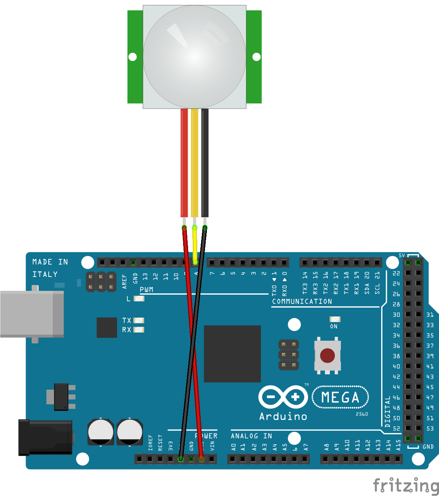

# Sensor de presença PIR

Para usar o sensor de presença PIR, usaremos o digitalRead que vai receber um valor High ou Low, tendo conexão com uma porta digital, assim que essa porta digital perceber algum movimento vai informar para o arduino exibindo no monitor serial, dando um sinal de HIGH. Caso não detecte nada, enviará um sinal de LOW.

## Montagem do circuito



## Código

```C
#define pinPIR 8 // Define o PIR com o valor "8" que é onde o pino digital está conectado

void setup() // Função setup é executada apenas uma vez
{
  pinMode (pinPIR, INPUT); // Configura o pino como entrada
  Serial.begin(9600); // inicia a comunicação serial a 9600 bits por segundo
}

void loop() // Função loop é para executar repetidamente o código
{
  if (digitalRead(pinPIR)== HIGH){  // Se houver movimento
  Serial.println("Presença detectada"); // Enviar para monitor serial
} else { 
  Serial.println("-----"); // Se não houver movimento enviar para monitor serial
}
}
```
## Referências

- [Datasheet do sensor](https://siccciber.com.br/wp-content/uploads/2020/06/FTC-PIR.pdf)


