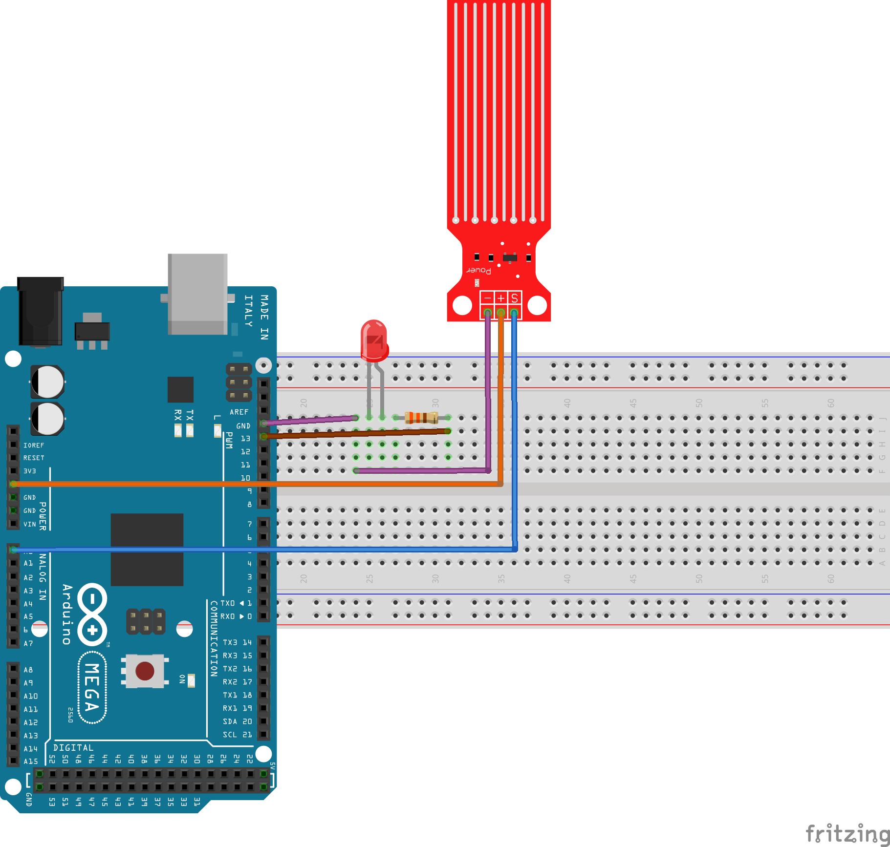

# Sensor de Água

## Montagem do Circuito


## Código

```C
#define entradaAnalogica 0  

int valorSensor   = 0;
int led   = 13 ; 


void setup() {
Serial.begin(9600);
pinMode (led, OUTPUT);    
 
}

void loop {
int valorSensor = analogRead (entradaAnalogica);
  
if
{
digitalWrite(led, HIGH)
  }
else {
digitalWrite(led, LOW) 
  }
delay(100);
}
```
