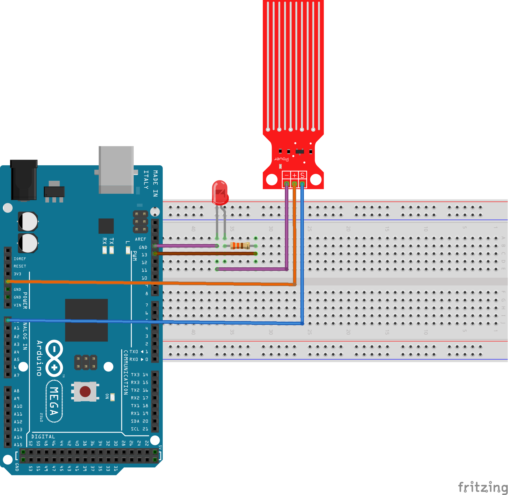

# Sensor de Água
O sensor de água detecta a presença de água devido as suas trilhas presentes na sua superfície. Adotamos uma predeterminação que, assumindo um valor de umidade maior que 300, o LED irá se acender, assim, indicando a presença de água. 

## Montagem do Circuito



## Código

```C
// Define a entrada analogica com o valor "0"
#define PINO_SENSOR_AGUA A0
// Define o LED com o valor "13" que é onde o pino está conectado
#define LED 13

// Função setup é executada apenas uma vez
void setup() {
  // inicia a comunicação serial a 9600 bits por segundo
  Serial.begin(9600);
  // Configura o pino do LED como saída
  pinMode (LED, OUTPUT);

}

/* Essas variáveis são globais pois é necessário
   manter os valores indenpendente do contexto de
   execução da função tarefa_1 */
const unsigned long periodo_tarefa_1 = 1000;
unsigned long tempo_tarefa_1 = millis();

/* Tarefa 1: envia o valor analógico para o PC */
void tarefa_1() {
  unsigned long tempo_atual = millis();

  int valorSensor;

  /* Hora de enviar os dados analógicos caso tenha passado 1000 ms */
  if (tempo_atual - tempo_tarefa_1 > periodo_tarefa_1) {
    tempo_tarefa_1 = tempo_atual;

    valorSensor = analogRead(PINO_SENSOR_AGUA);

    Serial.print("Valor : ");
    Serial.println(valorSensor);

    //Acender o LED de acordo com o valor da entrada analógica
    if (valorSensor > 300)
      digitalWrite(LED, HIGH);
    else
      digitalWrite(LED, LOW);

  }
}

/* Função loop() é responsável por escalonar as tarefas.
   Essa função é executada eternamete enquanto o Arduino estiver
   energizado */
void loop() {

  tarefa_1();

}
```

