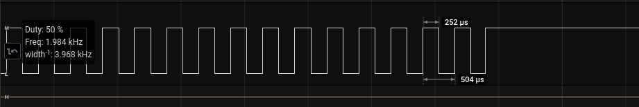

# Buzzer

Um buzzer pode-se utilizado em projetos eletrônicos para geração de alarmes ou informações sonoras. Caso o buzzer passivo tenha acionamento PNP, deve-se manter o pino em nível alto (HIGH) para desligar.

Use a função tone(pino, frequência) ou tone(pino, frequência, duração) para alterar a frequência sonora.

Veja [esse exemplo](./buzzer.ino) para gerar um alarme com frequência de 2kHz a cada 1s controlado pela serial.

Observe abaixo que o pino de acionamento é mantido em nível alto após a oscilação em 2KhZ.

## Referências

- [Documentação Arduino: Tone()](https://www.arduino.cc/reference/pt/language/functions/advanced-io/tone/)
- [Buzzer passivo 5V](https://www.filipeflop.com/produto/modulo-buzzer-5v-passivo/)

