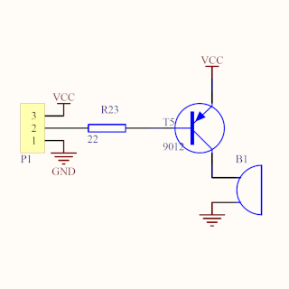

# Buzzer

Um buzzer pode ser utilizado em projetos eletrônicos para geração de alarmes ou informações sonoras. O buzzer é um dispositivo piezoelétrico reverso, o qual funciona a partir de uma diferença de potencial aplicada em seus terminais, com uma determinada frequência, dessa forma a célula dentro dele irá vibrar na mesma frequência emitindo um som.


Caso o buzzer seja passivo e tenha acionamento PNP, deve-se manter o pino em nível alto (HIGH) para desligar.



Use a função ```tone(pino, frequência) ``` ou ```tone(pino, frequência, duração)``` para alterar a frequência sonora.

Veja [esse exemplo](./buzzer.ino) para gerar um alarme com frequência de 2kHz a cada 1s controlado pela serial.

Observe abaixo que o pino de acionamento é mantido em nível alto após a oscilação em 2kHz.


## Vídeo do funcionamento 
- [Buzzer Passivo](https://youtu.be/uVtgTHC6Szc)

## Referências

- [Documentação Arduino: Tone()](https://www.arduino.cc/reference/pt/language/functions/advanced-io/tone/)
- [Buzzer passivo 5V](https://www.filipeflop.com/produto/modulo-buzzer-5v-passivo/)


