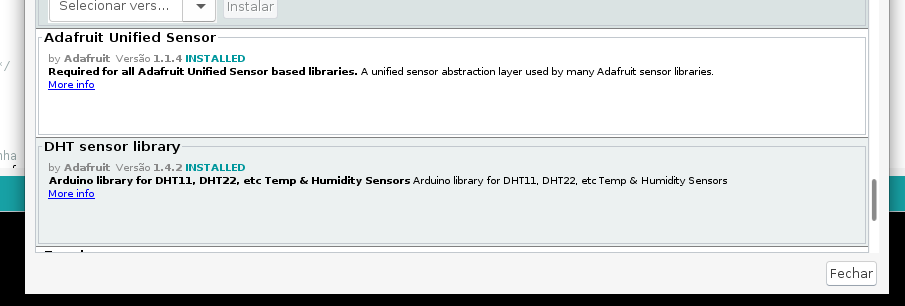
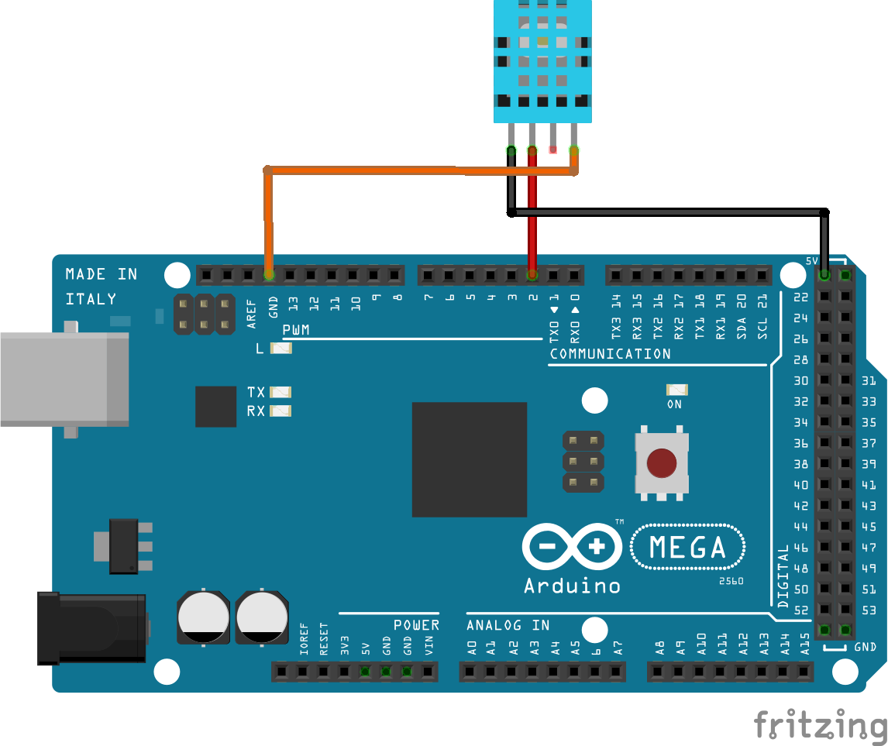

# Sensor de Umidade e Temperatura

O DHT11 é um sensor digital de temperatura e umidade que utiliza um barramento de comunicação serial simples de apenas um fio. É necessáio utilizar um resistor de _pull-up_ no pino de dados (ou utilizar pull-up interno do Arduino).

No caso do Arduino, utiliza-se duas bibliotecas específicas que simplificam a comunicação do sensor:

- Adafruit Unified Sensor
- DHT sensor library



## Montagem do Circuito



## Código
```C
//Inclui a biblioteca
#include <DHT.h>

//Pino digital onde está conectado o sensor
#define DHT11PIN 2
//Modelo do DHT
#define DHTTYPE  DHT11

DHT dht(DHT11PIN, DHTTYPE);

// Função setup é executada apenas uma vez
void setup() {
  // inicia a comunicação serial a 9600 bits por segundo
  Serial.begin(9600);
  // imprime uma mensagem inical
  // funcação F é uma indicação para manter a mensagem
  // na memória flash para economizar memória.
  Serial.println(F("Teste do DHT!"));
  // inicializa classe do sensor
  dht.begin();
}

// Função loop é para executar repetidamente o código
void loop()
{
  tarefa_1();
}

/* Essas variáveis são globais pois é necessário
   manter os valores independente do contexto de
   execução da função tarefa_1 */
const unsigned long periodo_tarefa_1 = 2000;
unsigned long tempo_tarefa_1 = millis();

//Envia os valores interios para o PC
void tarefa_1() {
  unsigned long tempo_atual = millis ();

  //Hora de enviar os dados caso tenha passado 2000 ms
  if (tempo_atual - tempo_tarefa_1 > periodo_tarefa_1) {

    // Lê a umidade
    float h = dht.readHumidity();
    // Lê a temperatura em Celsius
    float t = dht.readTemperature();
    // Lê a temperatura como Fahrenheit
    float f = dht.readTemperature(true);

    // Verifica se alguma leitura falhou
    if (isnan(h) || isnan(t) || isnan(f)) {
      Serial.println(F("Falha ao ler o sensor DHT!"));
      return;
    }
    // Envia para o computador (serial) os dados
    Serial.print(F("Umidade: "));
    Serial.print(h);
    Serial.print(F("%  Temperatura: "));
    Serial.print(t);
    Serial.print(F("°C "));
    Serial.print(f);
    Serial.println(F("°F"));
  }
}
```

## Resultados

Umidade: 95.00%  Temperatura: 29.50°C 85.10°F

Umidade: 94.00%  Temperatura: 29.60°C 85.28°F

Umidade: 92.00%  Temperatura: 29.80°C 85.64°F

Umidade: 90.00%  Temperatura: 29.90°C 85.82°F

Umidade: 89.00%  Temperatura: 29.90°C 85.82°F

Umidade: 88.00%  Temperatura: 29.90°C 85.82°F

Umidade: 87.00%  Temperatura: 29.90°C 85.82°F

Umidade: 86.00%  Temperatura: 30.10°C 86.18°F

Umidade: 86.00%  Temperatura: 30.00°C 86.00°F

## Vídeo do funcionamento 
- [Sensor de umidade e temperatura](https://youtu.be/C211qThi6kg)
