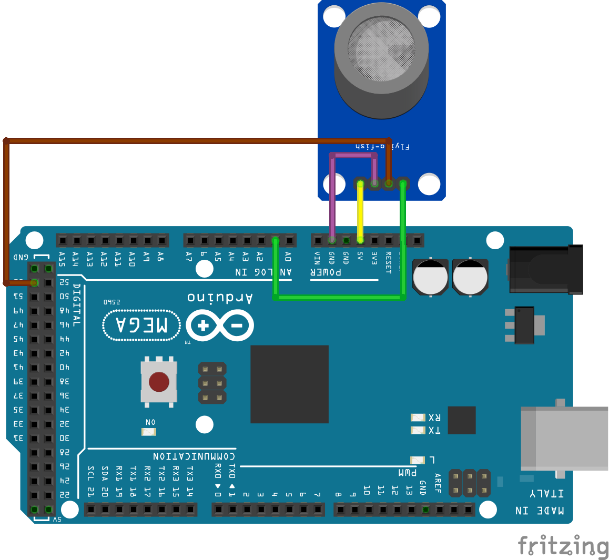

# Sensor de gás e fumaça

O sensor MQ-2 é um sensor que consegue identificar a presença de gases infumáveis ou fumaça em um ambiente. Quando ele detecta esses gases ele envia um sinal, que pode ser tanto analógico como digital, ao microcontrolador conectado.

O sensor MQ-2 possui duas saídas: uma analógica (A0) e outra digital (D0). A função ```_analogRead_``` pode ser utilizada para ler o valor inteiro proporcional ao gás detectado pelo sensor. Quanto ao pino digital, usa-se a função ```_digitalRead_```. O valor de gás detectado pelo sensor para a saída digital pode ser ajustado pelo ```_trimpot_```, o ajuste de sensibilidade azul, na parte de baixo do sensor. Nesse exemplo, ambas as saídas do sensor são exibidas no Monitor Serial. Assim que o sensor detectar a presença de um gás inflamável ou fumaça, a entrada digital vai ficar com o valor zero e os valores da entrada analógica começam a subir.

## Montagem do Circuito



## Código

```C
// Define a entrada digital com o valor "53"
#define ENTRADA_DIGITAL 53
// Define a entrada analogica com o valor "1"
#define ENTRADA_ANALOGICA A1

// Recebe a leitura feita no pino digital
bool dSensor;
// Recebe a leitura feita no pino analógico
int aSensor;

// Função setup é executada apenas uma vez
void setup()
{
  // Configura a entrada digital como entrada
  pinMode (ENTRADA_DIGITAL, INPUT);
  // Inicia a comunicação serial a 9600 bits por segundo
  Serial.begin(9600);
}


/* Essas variáveis são globais pois é necessário
   manter os valores independente do contexto de
   execução da função tarefa_1 */
const unsigned long periodo_tarefa_1 = 1000;
unsigned long tempo_tarefa_1 = millis();

//Envia os valores interios para o PC
void tarefa_1(unsigned long tempo_atual) {
  
  //Hora de enviar os dados caso tenha passado 1000 ms
  if (tempo_atual - tempo_tarefa_1 > periodo_tarefa_1) {

    // Faz a leitura do sensor
    dSensor = digitalRead(ENTRADA_DIGITAL);
    aSensor = analogRead(ENTRADA_ANALOGICA);

    // Envia para o computador (serial) os dados
    Serial.print("Leitura entrada digital: ");
    Serial.println(dSensor);
    Serial.print("Leitura entrada analógica: ");
    Serial.println(aSensor);
    Serial.println();

  }


// Função loop é para executar repetidamente o código
void loop()
{

unsigned long tempo_atual = millis ();

tarefa_1();

 }
```

## Resultados

Leitura entrada digital: 1
Leitura entrada analógica: 24

Leitura entrada digital: 0
Leitura entrada analógica: 766

Leitura entrada digital: 0
Leitura entrada analógica: 918

## Vídeo do funcionamento 
- [Sensor de gás e fumaça](https://youtu.be/tYmWpk2kVjs)

## Referências

- [Sensor de Gás](https://www.masterwalkershop.com.br/sensor-detector-de-gas-inflamavel-fumaca-mq-2)
