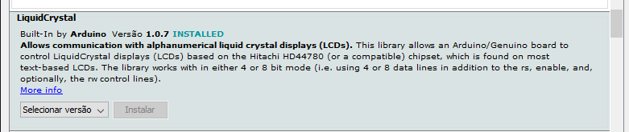
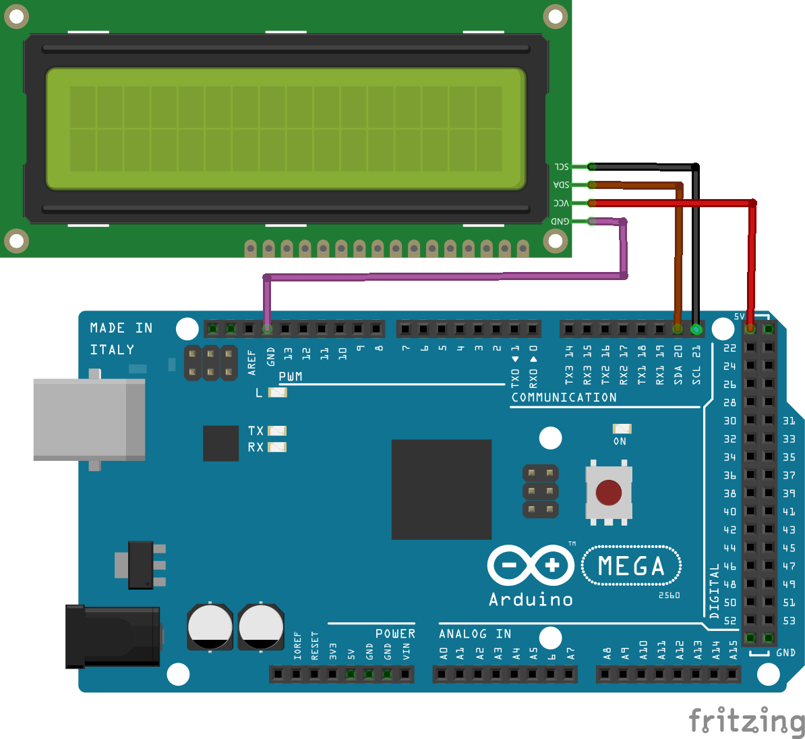

# Display LCD 16×2 I2C

O display LCD possui um módulo I2C que reduz o número de conexões pois utiliza-se comunicação serial ao invés de paralela. Certifique-se da conexão utilizando os pinos específicos SDA e SCL.  É necessária também a biblioteca *LiquidCrystal_I2C*.



## Montagem do circuito

          

## Código

```C
// Inclui a biblioteca
#include <Wire.h>
// Inclui a biblioteca
#include <LiquidCrystal_I2C.h>

// Define o endereço LCD para 0x27 para um display de 16 caracteres e 2 linhas
LiquidCrystal_I2C lcd(0x27, 20, 4);

// Função setup é executada apenas uma vez
void setup()
{
  // inicializa o LCD
  lcd.init();
  //liga a luz de fundo
  lcd.backlight();
  // Posição do cursor
  lcd.setCursor(1, 0);
  // Imprime uma mensagem no LCD
  lcd.print("Ola");
  // Posição do cursor
  lcd.setCursor(1, 1);
  // Imprime uma mensagem no LCD
  lcd.print("Testando");
}


void loop()
{
}
```

## Vídeo do funcionamento 
- [Display LCD](https://youtu.be/uBbCTLTkzt8)

