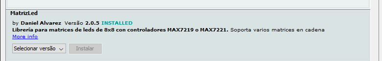

# Matriz de LED 8×8 com MAX7219

A matriz de LED é um painel formado por LEDS, por conta da complexidade, precisamos utilizar uma biblioteca para funcionar o nosso letreiro que no nosso caso será a biblioteca *MatrizLed*.



## Montagem do circuito


## Código

```C
// Inclui a biblioteca
#include <MatrizLed.h>

// Nomeando a matriz de led
MatrizLed matriz;

// Função setup é executada apenas uma vez
void setup() {
  // dataPin, clkPin, csPin, numero de matrizes de 8x8
  matriz.begin(10, 8, 9, 2); 
  // Caso ocorra falha
  matriz.rotar(false); 
}

void tarefa_1(){

  matriz.borrar();
  // Exibe o texto na matriz de led
  matriz.escribirFraseScroll("Testando", 200); 
  
  }
  
  
// Função loop é para executar repetidamente o código
void loop() {

tarefa_1();

}
```

## Vídeo do funcionamento 
- [Matriz de LED](https://youtu.be/okbFl04yyuc)
