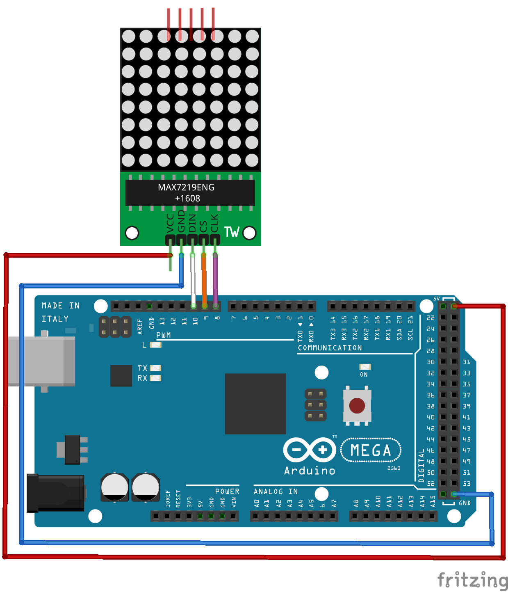

# Matriz de LED 8×8 com MAX7219

## Montagem do circuito



## Código

```C
// Inclui a biblioteca
#include <MatrizLed.h>

// Nomeando a matriz de led
MatrizLed matriz;

// Função setup é executada apenas uma vez
void setup() {
  // dataPin, clkPin, csPin, numero de matrizes de 8x8
  matriz.begin(10, 8, 9, 2); 
  // Caso ocorra falha
  matriz.rotar(false); 
}

// Função loop é para executar repetidamente o código
void loop() {
  matriz.borrar();
  // Exibe o texto na matriz de led
  matriz.escribirFraseScroll("Testando", 200); 
}
```

## Vídeo do funcionamento 
- [Matriz de LED](https://youtu.be/By8FwmsfYa4)
