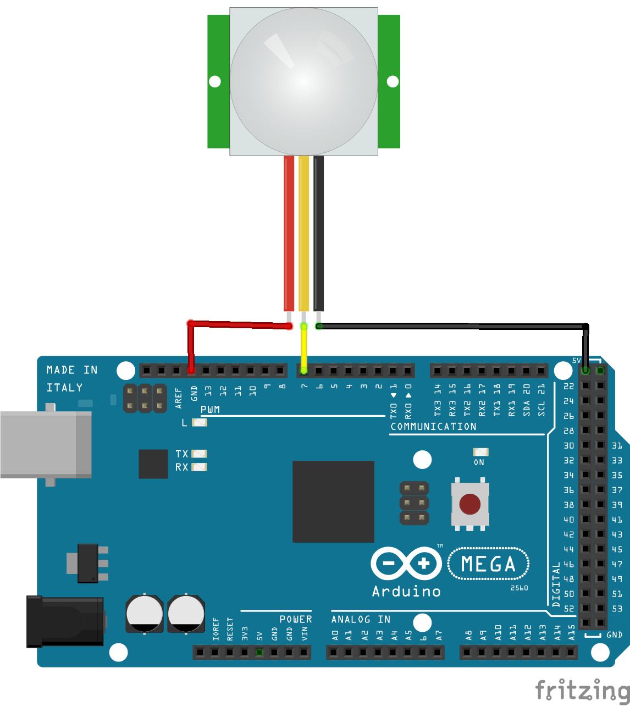

# Sensor de presença PIR

O PIR é um sensor que capta a radiação infravermelha de um corpo e assim aciona o que for desejado. Ele é um sensor capaz de detectar o movimento de corpos que emitam calor e que estejam em seu campo de alcance. A sensibilidade do alcance e do tempo de duração do sinal podem ser ajustados no próprio sensor.

Com o sensor de presença PIR, utliza-se a função ```digitalRead``` comparando seu retorno com valores High (nível alto) ou Low (nível baixo). Assim, quando houver detecção de movimento, o sensor mudará o estado da porta digital e o Arduino exibirá o valor no monitor serial.

## Montagem do circuito



## Código

```C
// Define o PIR com o valor "7" que é onde o pino digital está conectado
#define pinPIR 7

// Função setup é executada apenas uma vez
void setup() /
{
  // Configura o pino como entrada
  pinMode (pinPIR, INPUT);
  // inicia a comunicação serial a 9600 bits por segundo
  Serial.begin(9600);
}

// Função loop é para executar repetidamente o código
void tarefa_1()
{
  // Se houver movimento
  if (digitalRead(pinPIR) == HIGH) {
    // Enviar para monitor serial
    Serial.println("Presença detectada");
  } 
  else {
    // Se não houver movimento enviar para monitor serial
    Serial.println("-----");
  }
}

void loop() {

  tarefa_1();
  
}
```

## Vídeo do funcionamento
- [Sensor de presença PIR](https://youtu.be/BA93fHSoEoE)

## Referências

- [Datasheet do sensor](https://siccciber.com.br/wp-content/uploads/2020/06/FTC-PIR.pdf)
