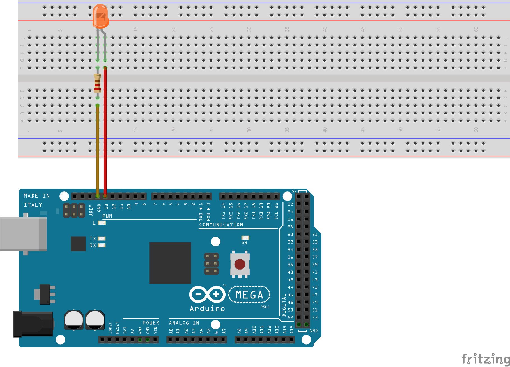

# LED

Para entender o funcionamento do Arduino, pode-se começar com um simples pisca LED utilizando funções básicas como PinMode e DigitalWrite. A função do PinMode vai ditar o comportamento do pino, se ele é saída ou entrada. Já o digitalWrite escreve nível alto (High) ou baixo (LOW) em um pino, consequentemente ligando e desligando o LED conectado nesse pino.

## Montagem do circuito

Para utilizar o LED no Arduino utiliza-se resistores para que a corrente seja reguladas e os componentes não sofram danos. O resistor utilizado nesse exemplo é de 330 ohms, podendo ser admitidos outros valores e LEDs diferentes.

          

## Código

```C
// Define o LED com o valor "11" que é onde o pino está conectado
#define LED 11

// Função setup é executada apenas uma vez
void setup()
{
  // Configura o pino do LED como saída
  pinMode (LED, OUTPUT);
}

// Função loop é para executar repetidamente o código
void loop()
{
  // Acender LED
  digitalWrite(LED, HIGH);
  // Aguarda 1000 milissegundos
  delay(1000);
  // Apagar LED
  digitalWrite(LED,LOW);
  // Aguarda 1000 milissegundos
  delay(1000);
}
```
