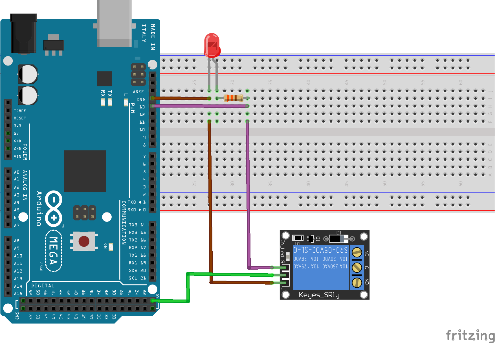

# Módulo Relé 1 Canal 5V

O módulo relé é importante para isolar circuitos de maior potência do Arduino. Nesse exemplo, apenas se acende um LED para mostrar o funcionamento. Lembre-se que o relé é apenas uma chave aberta (NA - normalmente aberto) ou fechada (NF - normalmento fechado) sendo necessário conectar a alimentação e os demais componentes conforme a necessidade.

## Montagem do Circuito



## Código

```C
// Define o pino "13" onde o relé está conectado
#define RELE 13

// Função setup é executada apenas uma vez
void setup() {

  // Configura o pino do relé como saída
  pinMode (RELE, OUTPUT);

}

// Função loop é para executar repetidamente o código
void tarefa_1()
{
  // Liga o relé
  digitalWrite(RELE, HIGH);
  // Aguarda 2000 ms
  delay(2000);
  // Desliga o relé
  digitalWrite(RELE, LOW);
  // Aguarda 2000 ms
  delay(2000);
}

void loop{

tarefa_1();

}
```

## Vídeo do funcionamento 
- [Módulo Relé 1 Canal 5V](https://youtu.be/qVC-S7XtKO4)
