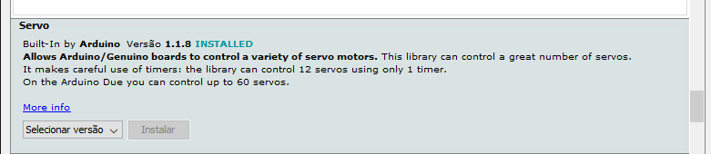

# Micro Servo SG92R 9g TowerPro

O Servo Motor é em grande parte utilizado para controle de movimento que exigem posicionamento de alta precisão. Eles são motores comuns que possui acoplado a ele um sensor de velocidade e um controlador. Ele trabalha com servo-mecanismo que usa o feedback de posição para controlar a velocidade e a posição final do motor.

O micro servo possui um motor e um circuito eletrônico capaz de direcionar o eixo para um ângulo específico. O servo utilizado tem o seu ângulo de rotação máxima de 180°.

Nesse caso vamos precisar utilizar uma biblioteca:

- Servo



## Montagem do circuito

          

## Código

```C
// Inclui a biblioteca
#include <Servo.h>
// Pino digital onde está conectado o servo
#define SERVOPIN 3

// Nomeando o servo
Servo SRV;

// Armazena a posição do servo
int pos = 0;

// Função setup é executada apenas uma vez
void setup()
{
  //Porta onde o servo está conectado
  SRV.attach(SERVOPIN);
}
void tarefa_1(){

  // 0 graus a 180 graus
  for (pos = 0; pos <= 180; pos += 1) {
    // Troca de posição
    SRV.write(pos);
    // Aguarda 15 ms
    delay(15);
  }
  // 180 graus a 0 graus
  for (pos = 180; pos >= 0; pos -= 1) {
    // Troca de posição
    SRV.write(pos);
    // Aguarda 15 ms
    delay(15);
  }
}


// Função loop é para executar repetidamente o código
void loop()
{

tarefa_1();

}
```

## Vídeo do funcionamento 
- [Micro Servo](https://youtu.be/1cqJoaoE0Bc)
