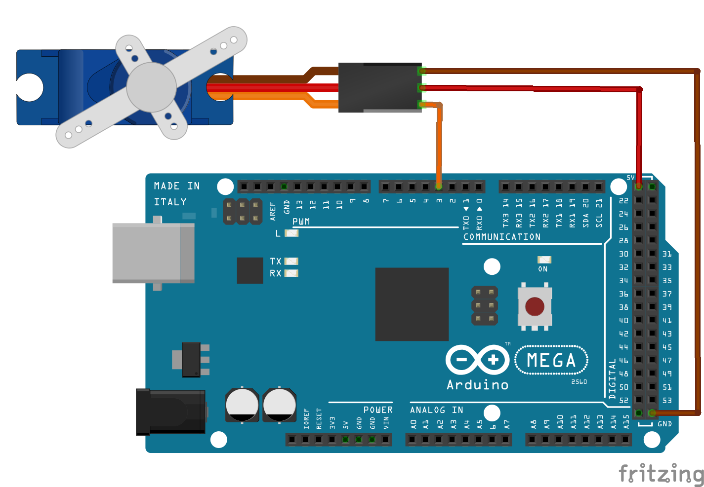

# Micro Servo SG92R 9g TowerPro

O micro servo possui um motor capaz de direcionar ele para um ângulo específico. O servo que vamos utilizar tem o seu ângulo de rotação máxima de 180°, e pode ser controlado de forma muito precisa com o Arduino.

## Montagem do circuito

          
