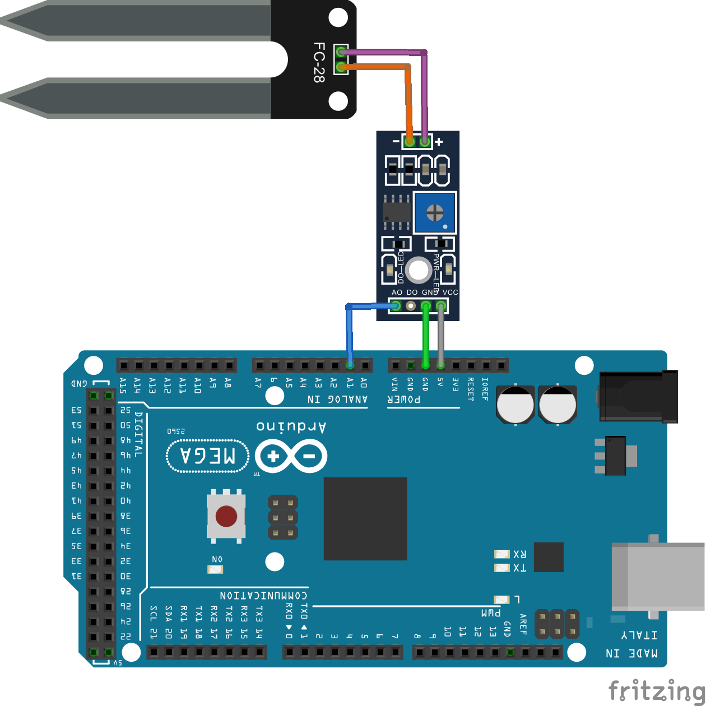

# Sensor de Umidade do solo

O sensor de umidade de solo detecta as variações de umidade através da alteração da resistência elétrica. Ele é formado por duas partes, sendo uma delas as pontas que serão colocados diretamente no solo e um circuito com o amplificador operacional. 

## Montagem do Circuito



## Código
```C
// Define a entrada analogica com o valor "1"
#define ENTRADA_ANALOGICA A1

// Recebe a leitura feita no pino analógico
int aRec;

// Função setup é executada apenas uma vez
void setup()
{
  // Inicia a comunicação serial a 9600 bits por segundo
  Serial.begin(9600);
}

// Função loop é para executar repetidamente o código
void loop()
{
  tarefa_1();
}

/* Essas variáveis são globais pois é necessário
   manter os valores independente do contexto de
   execução da função tarefa_1 */
const unsigned long periodo_tarefa_1 = 1000;
unsigned long tempo_tarefa_1 = millis();

//Envia os valores interios para o PC
void tarefa_1() {
  unsigned long tempo_atual = millis ();

  //Hora de enviar os dados caso tenha passado 1000 ms
  if (tempo_atual - tempo_tarefa_1 > periodo_tarefa_1) {

    // Faz a leitura do sensor
    aRec = analogRead(ENTRADA_ANALOGICA);

    // Envia para o computador (serial) os dados
    Serial.print("Leitura entrada analógica: ");
    Serial.println(aRec);
    Serial.println();

  }
}
```

## Resultados
Leitura entrada analógica: 765

Leitura entrada analógica: 718

Leitura entrada analógica: 601

Leitura entrada analógica: 509

Leitura entrada analógica: 445

Leitura entrada analógica: 378
